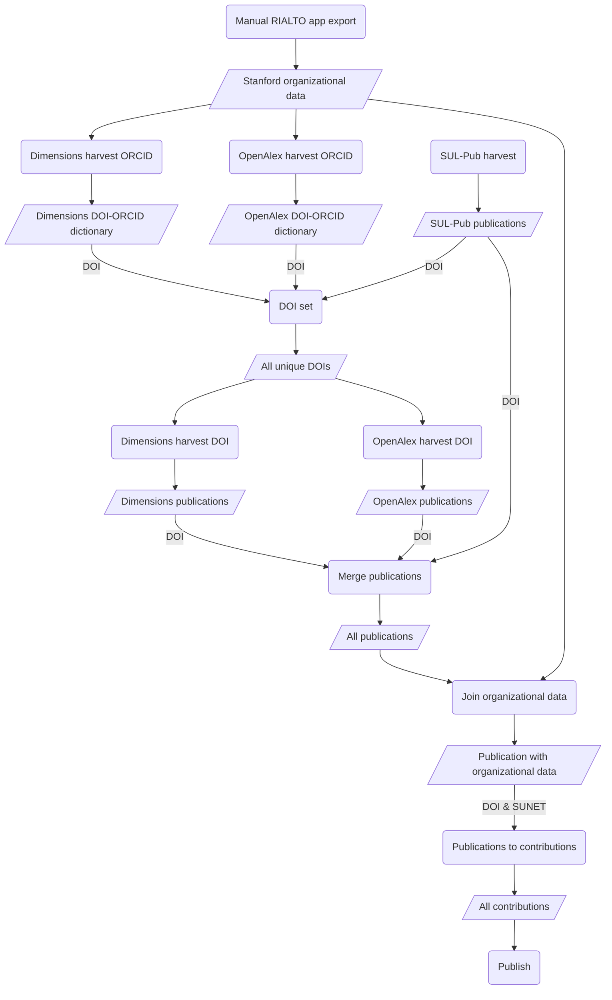

# rialto-airflow

[](https://github.com/sul-dlss-labs/rialto-airflow/actions/workflows/test.yml)
[](https://codecov.io/gh/sul-dlss/rialto-airflow)

Airflow for harvesting data for open access analysis and research intelligence. The workflow integrates data from [sul_pub](https://github.com/sul-dlss/sul_pub), [rialto-orgs](https://github.com/sul-dlss/rialto-orgs), [OpenAlex](https://openalex.org/) and [Dimensions](https://www.dimensions.ai/) APIs to provide a view of publication data for Stanford University research. The basic workflow is: fetch Stanford Research publications from SUL-Pub, OpenAlex, and Dimensions, enrich them with additional metadata from OpenAlex and Dimensions using the DOI, merge the organizational data found in [rialto_orgs], and publish the data to our JupyterHub environment.



## Running Locally with Docker

Based on the documentation, [Running Airflow in Docker](https://airflow.apache.org/docs/apache-airflow/stable/start/docker.html).

1. Clone repository `git clone git@github.com:sul-dlss/rialto-airflow.git` (cloning using the git over ssh URL will make it easier to push changes back than using the https URL)

2. Start up docker locally.

3. Create a `.env` file with the following values. For local development these can usually be as below.  To ensure the tests work correctly, look at the section below labeled `Test Setup`, which will tell you exactly which values need to be set and from where in order to have the tests work.
```
AIRFLOW_UID=50000
AIRFLOW_GROUP=0
AIRFLOW_VAR_DATA_DIR="data"
AIRFLOW_VAR_GOOGLE_CONNECTION="google_cloud_default"
AIRFLOW_VAR_GOOGLE_SERVICE_ACCOUNT_JSON=xxxx # the google service account JSON from vault
AIRFLOW_CONN_GOOGLE_CLOUD_DEFAULT="google-cloud-platform://?keyfile_dict=${AIRFLOW_VAR_GOOGLE_SERVICE_ACCOUNT_JSON}&scope=https%3A%2F%2Fwww.googleapis.com%2Fauth%2Fdrive%2Chttps%3A%2F%2Fwww.googleapis.com%2Fauth%2Fspreadsheets&project=sul-rialto&num_retries=5"
AIRFLOW_VAR_GOOGLE_DRIVE_ID=xxxx # this is the ID of the shared google drive that DAGs can write to (e.g. RIALTO Core Team --> Airflow-Prod )
AIRFLOW_TEST_GOOGLE_DRIVE_ID=xxxx # this is the ID of the shared google drive called "RIALTO Core Team --> Airflow-Test" used by the tests
AIRFLOW_TEST_GOOGLE_SHEET_ID=xxxx # this is the ID of the google sheet called "Test" in the "RIALTO Core Team --> Airflow-Test" folder used by the tests
```
(See [Airflow docs](https://airflow.apache.org/docs/apache-airflow/2.9.2/howto/docker-compose/index.html#setting-the-right-airflow-user) for more info.)

4. Add to the `.env` values for any environment variables used by DAGs. For the VMs, they will be applied by puppet.  For localhost, you can use the following to generate secret content for your dev .env file from stage (you can also prod if you really needed to by altering where in puppet you look below):

```
for i in `vault kv list -format yaml puppet/application/rialto-airflow/stage | sed 's/- //'` ; do \
  val=$(echo $i| tr '[a-z]' '[A-Z]'); \
  echo AIRFLOW_VAR_$val=`vault kv get -field=content puppet/application/rialto-airflow/stage/$i`; \
done
```

5. The harvest DAG requires a CSV file of authors from rialto-orgs to be available. This is not yet automatically available, so to set up locally, download the file at
https://sul-rialto-stage.stanford.edu/authors?action=index&commit=Search&controller=authors&format=csv&orcid_filter=&q=. Put the `authors.csv` file in the `data/` directory.

6. Bring up containers.
```
docker compose up -d
```

7. The Airflow application will be available at `localhost:8080` and can be accessed with the default Airflow username and password.

## Development

### Console

```
uv run dotenv run python
```

### Set-up

1. Install `uv` for dependency management as described in [the uv docs](https://github.com/astral-sh/uv?tab=readme-ov-file#getting-started).  _NOTE:_ As of Feb 2025, at least one developer has had better luck with dependency management using the `uv` standalone installer, as opposed to installing using `pip` or `pipx`.  YMMV of course, but if you run into hard to explain `pyproject.toml` complaints or dependency resolution issues, consider uninstalling the `pip` managed `uv`, and installing from the `uv` installation script.

To add a dependency, e.g. flask:
1. `uv add flask`
3. Then commit `pyproject.toml` and `uv.lock` files.

You'll have to rebuild and restart containers for new dependencies to get picked up (both locally and in deployed envs), since the dependency installations are baked into the container image at build time (unlike the DAG/task code). Like our Rails apps, a redeploy should take care of rebuild and restart in deployed environments.

### Upgrading dependencies
To upgrade Python dependencies:
```
uv lock --upgrade
```

Like dependency additions, dependency updates require container rebuild/restart.

## Run Tests

```
docker compose up -d postgres
uv run pytest
```

### Test Setup

In order for some of the tests to run, they will need to hit actual APIs.  In order to do this,
they will need to be properly configured with keys and URLs.  These need to be placed in the .env file.
Note that if you have hard-coded values in the compose.yml files, they will override any hardcoded values in the .env file.

For Google drive tests, update your .env with values shown below / pulled from vault as indicated:

```
AIRFLOW_VAR_GOOGLE_CONNECTION="google_cloud_default"
AIRFLOW_VAR_GOOGLE_SERVICE_ACCOUNT_JSON=${get from vault at `rialto-airflow/prod/google_service_account_json`}
AIRFLOW_CONN_GOOGLE_CLOUD_DEFAULT="google-cloud-platform://?keyfile_dict=${AIRFLOW_VAR_GOOGLE_SERVICE_ACCOUNT_JSON}&scope=https%3A%2F%2Fwww.googleapis.com%2Fauth%2Fdrive%2Chttps%3A%2F%2Fwww.googleapis.com%2Fauth%2Fspreadsheets&project=sul-rialto&num_retries=5"
AIRFLOW_VAR_GOOGLE_DRIVE_ID=${get from vault at `puppet/application/rialto-airflow/prod/google_drive_id`}
AIRFLOW_TEST_GOOGLE_SHEET_ID=${get from vault at `puppet/application/rialto-airflow/test/test_google_sheet_id`} # used by CI and tests
AIRFLOW_TEST_GOOGLE_DRIVE_ID=${get from vault at `puppet/application/rialto-airflow/test/test_google_drive_id`} # used by CI and tests
```

In addition, for the Google drive tests to run correctly, you need a few things configured in Google Drive:

- A shared google drive folder must be setup, and must be shared with the email address of the google service account with "content manager" privileges.  The ID of the google drive folder must be configured in the `AIRFLOW_TEST_GOOGLE_DRIVE_ID` variable
- A shared google sheet must be setup, and must be shared with the email address of the google service account with "editor" privileges.  It must be called "Test" and placed in the shared google drive setup above.  The ID of the google sheet must be configured in the `AIRFLOW_TEST_GOOGLE_SHEET_ID` variable.
- See the section `Google Drive Setup` below for information about the google service account and the email address associated with it.

The drive and sheet should be setup and configured, in "RIALTO Core Team -> Airflow-Test".  There may be an "authors.csv" file in the test shared folder as well - it is generated by the tests.  This file is safe to delete if you are troubleshooting.

For MaIS tests, update your .env with values shown below / pulled from vault as indicated:

```
AIRFLOW_VAR_MAIS_BASE_URL=https://mais.suapi.stanford.edu
AIRFLOW_VAR_MAIS_TOKEN_URL=https://mais.auth.us-west-2.amazoncognito.com
AIRFLOW_VAR_MAIS_CLIENT_ID=${get from vault at `puppet/application/rialto-airflow/prod/mais_client_id`}
AIRFLOW_VAR_MAIS_SECRET=${get from vault at `puppet/application/rialto-airflow/prod/mais_secret`}
```

Note: The MaIS `test_mais.py` file depends on the MaIS API being configured specifically with production (not UAT) credentials.  If no credentials are available in the environment variables, the tests will be skipped completely.  If UAT credentials are supplied, some of the tests may fail, since they assert checks against production data.

### Test coverage reporting

In addition to the terminal display of a summary of the test coverage percentages, you can get a detailed look at which lines are covered or not by opening `htmlcov/index.html` after running the test suite.

### Linting and formatting

1. Run linting: `uv run ruff check`
2. Automatically fix lint: `uv run ruff check --fix`
3. Run formatting: `uv run ruff format` (or `uv run ruff format --check` to identify any unformatted files,  or `uv run ruff format --diff` to see what would change without applying)

### Type Checking

To see if there are any type mismatches:

```
uv run mypy .
```

### Run all the checks

One line for running the linter, the type checker, and the test suite (failing fast if there are errors):
```
uv run ruff format --diff . && uv run ruff check && uv run mypy . && uv run pytest
```

### Troubleshooting

Getting errors with dependencies when trying to run the tests that look something like this?

`AttributeError: module 'psycopg2' has no attribute 'paramstyle'`

Try clearing the virtual env folder and let it rebuild on the next run: `rm -rf .venv`

## Deployment

Deployment to https://sul-rialto-airflow-XXXX.stanford.edu/ is handled like other SDR services using Capistrano. You'll need to have Ruby installed and then:

```
bundle exec cap stage deploy # stage
bundle exec cap prod deploy  # prod
# Note: there is no QA
```

By default, deployment will use the deployed branch's code to build a fresh Docker image locally, and will restart `docker compose`, which will cause it to pick up the new image.

If you'd like to push an image to Docker Hub (or any other registry) for deployment, consider reserving the `latest` tag for builds from the `main` branch, and pushing a branch-specific image tag if deploying a branch other than `main`.  See `compose.yaml` (for local dev) and `compose.prod.yaml` (for stage/prod deployment) for more detail on using the registry image instead of a build from `Dockerfile`.

## Google Drive

In order to access Google Drive (write files to google drive, create/update sheets, etc), several things must be configured correctly.

### Using the google integration in a DAG

In cases where a Google folder and file ID is referenced, you can get this ID by opening the Google Drive UI, and then opening the file or folder and looking at the URL.

The google drive folder you are adding to, or sheet you are operating on, or file you are replacing must be shared correctly with the google service account for permissions to work correctly.  This process is described below, though shared drives for use by RIALTO airflow are already setup.

To use the integration from a DAG, import the methods and setup the variables you need:

```
from airflow.models import Variable

from rialto_airflow.google import (
    clear_google_sheet,
    append_rows_to_google_sheet,
    replace_file_in_google_drive,
    upload_file_to_google_drive,
    upload_or_replace_file_in_google_drive
)

gcp_conn_id = Variable.get("google_connection")
```

Then in your tasks, you can call the methods like this:

1. To completely replace an existing file in a Google Drive, pass in the name of the local file and the remote Google file ID to replace.  This file must exist and have an ID:

```
replace_file_in_google_drive(
    "/opt/airflow/rialto_airflow/dags/google.py",
    "LONG-GOOGLE-FILE_ID-GOES-HERE",
)
```

2. To upload a new file to a Google Drive, pass in the name of the local file and the remote Google drive folder ID to put the file in.  If a file of the same filename exists, you will get a new copy with a new google file ID:

```
upload_file_to_google_drive(
    "/opt/airflow/rialto_airflow/dags/harvest.py",
    "LONG-GOOGLE-FOLDER-ID-GOES-HERE",
)
```

3. To clear a Google sheet, pass in the sheet ID:

```
clear_google_sheet("LONG-GOOGLE-SHEET-ID-GOES-HERE")
```

4. To add a row an existing Google Sheet, pass in the sheet ID and an array of data to append:
```
append_rows_to_google_sheet(
    "LONG-GOOGLE-SHEET-ID-GOES-HERE",
    [
        [
            "Hello",
            "World",
            "Column",
            "Three",
        ]
    ],
)
```

5. To upload or replace a file in Google Drive, pass in the filename and google drive folder.  This is useful when you are uploading a file for the first time, but then later replacing that exact same file:

```
upload_or_replace_file_in_google_drive(
    "/opt/airflow/rialto_airflow/dags/harvest.py",
    "LONG-GOOGLE-FOLDER-ID-GOES-HERE",
)
```

### GCP Setup

NOTE: This should already by setup for stage and prod and properly configured.  You still need the JSON service account in your local env file as described above.  It is in vault.

1. You will need a Google Cloud Platform (GCP) project, which has billing enabled and setup.  Look up how to do this or ask for help from Ops if there isn't already an existing DLSS GCP project that can be used.
2. Ensure all of the needed APIs are enabled for this project.  These are under APIs & Services.  You want to ensure these are enabled:
- Cloud Storage
- Google Drive API
- Google Sheets API
3. You need a service account in GCP under this project.  Once the project is selected, go to IAM > Service Accounts to create (or select an existing if appropriate) service account.  Name the service account "RIALTO Airflow Integration" or similar and provide a description.
4. You will need to create and download a JSON Key file for this service account.  Once you have selected the service account under IAM > Service Accounts, edit it with the pencil icon, find the "Keys" tab and add a key (of type "JSON").  It should offer to let you download the key as a JSON file.  Save this file.
5. Grant this service account permissions to access Google Drive.  Do this by going to IAM and scrolling down to find the name of the service account.  Edit it by clicking the pencil icon.  Click "Add another role" and then add the role "Storage Object Admin" and save the user.
6. The JSON key contents are URL encoded and stored in vault, so they can be set in an env variable by puppet.  For localhost development, the value stored in vault is set in your local .env file.  See Airflow setup below.

### Airflow Setup

NOTE: The connection is setup automatically in the compose.yaml file with the `AIRFLOW_CONN_GOOGLE_CLOUD_DEFAULT` env variable.  It specifies the URL encoded contents of the JSON key file and the other attributes.  For localhost, you will need to have the URL encoded JSON file for the service account set in your .env file (which you can get from vault)

You can also create manual connections as described below, but this should not be necessary and is only here for information purposes.

1. In Airflow, go to the "Admin" menu and select "Connections".
2. If it doesn't exist, create a connection by clicking the + button.
3. The connection info is below (skip the quotes, they just denote the value to enter):

connection id: "google_cloud_default" # must match what is in docker compose.yaml for AIRFLOW_VAR_GOOGLE_CONNECTION
connection type: "Google Cloud"
description: # something useful, e.g. "Google Drive connection"
project id: # the exact ID of the google project in GCP from step 1 in the GCP Setup, e.g. "sul-rialto"
keyfile path: # this is the path to the JSON file you downloaded in step 3 in the GCP Setup.  It needs to be put on the VM/docker image and this is the full path to where it is placed
keyfile JSON: # alternatively, you can paste in the full contents of the JSON here instead of putting the file on the VM/docker image...but if you use this approach and later come back to edit the connection, you will need to re-paste the JSON before saving again
credential configuration file: # leave blank
Scopes: "https://www.googleapis.com/auth/drive,https://www.googleapis.com/auth/spreadsheets"

everything else can be left blank/default

Click "Save" to save the connection.

4. Note that the connection id (e.g. "google_cloud_default") is going to referenced in the Airflow DAG definitions, so it needs to match what is in the code.

### Google Drive Setup

1. Find the Google Drive folder you want Airflow to be able to access.  We are using folders called "Airflow-XXX" (for the various environments) within the "RIALTO Core Team" shared Google drive.
2. Click the sharing setup in Google Drive for the folder.
3. Copy the full email address of the GCP Service account (e.g.  rialto-airflow-integration@sul-rialto.iam.gserviceaccount.com) and share the Google Drive folder with that user, providing "Admin" or "Content Manager" access.  Save.
4. Note that google drive ID of the shared folder by opening the folder in Google Drive, and looking at the URL... it will contain the ID (e.g. https://drive.google.com/drive/u/1/folders/THIS_IS_THE_GOOGLE_DRIVE_FOLDER_ID)  This ID will be set in Vault, and then picked up as an environment variable by Puppet.  For local development, you can use the "Airflow-Dev" shared folder or any folder of your choosing (with correct permissions), as long as you correctly configured the folder ID in your local .env file.
5. For accessing a Google Sheet, you will need to setup a new sheet, share it in the same as the folder in step #3 above, note the ID of the sheet as described in step #4 above, and then use this sheet ID either directly in the code, or set it and reference it as a variable in the Airflow UI, or similarly in Vault/Puppet as is done for the shared Google drive.
