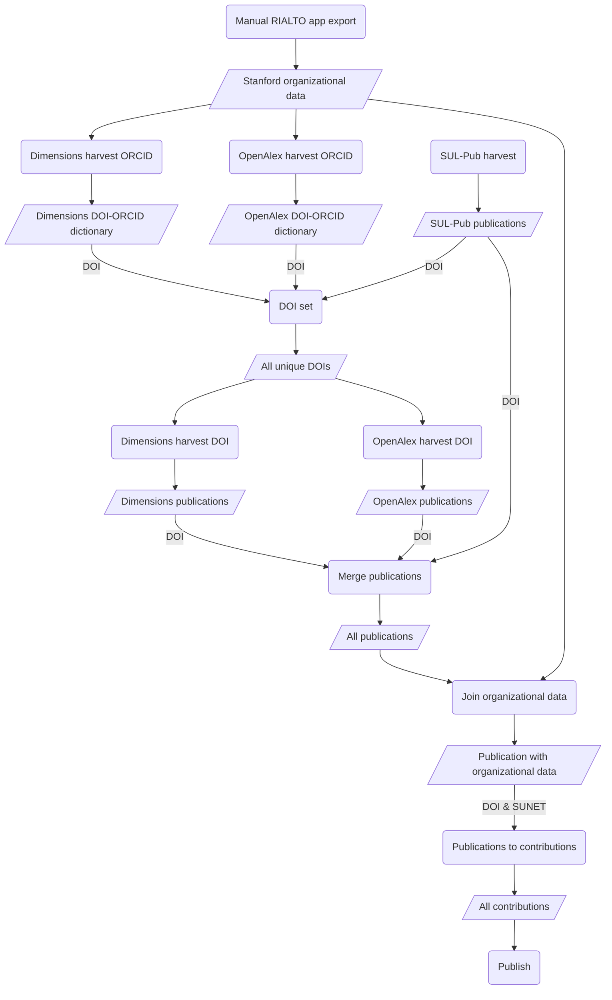

# rialto-airflow

[](https://github.com/sul-dlss-labs/rialto-airflow/actions/workflows/test.yml)
[](https://codecov.io/gh/sul-dlss/rialto-airflow)

Airflow for harvesting data for open access analysis and research intelligence. The workflow integrates data from [sul_pub](https://github.com/sul-dlss/sul_pub), [rialto-orgs](https://github.com/sul-dlss/rialto-orgs), [OpenAlex](https://openalex.org/) and [Dimensions](https://www.dimensions.ai/) APIs to provide a view of publication data for Stanford University research. The basic workflow is: fetch Stanford Research publications from SUL-Pub, OpenAlex, and Dimensions, enrich them with additional metadata from OpenAlex and Dimensions using the DOI, merge the organizational data found in [rialto_orgs], and publish the data to our JupyterHub environment.



## Running Locally with Docker

Based on the documentation, [Running Airflow in Docker](https://airflow.apache.org/docs/apache-airflow/stable/start/docker.html).

1. Clone repository `git clone git@github.com:sul-dlss/rialto-airflow.git` (cloning using the git over ssh URL will make it easier to push changes back than using the https URL)

2. Start up docker locally.

3. Create a `.env` file with the `AIRFLOW_UID` and `AIRFLOW_GROUP` values. For local development these can usually be:
```
AIRFLOW_UID=50000
AIRFLOW_GROUP=0
AIRFLOW_VAR_DATA_DIR="data"
```
(See [Airflow docs](https://airflow.apache.org/docs/apache-airflow/2.9.2/howto/docker-compose/index.html#setting-the-right-airflow-user) for more info.)

4. Add to the `.env` values for any environment variables used by DAGs. Not in place yet--they will usually applied to VMs by puppet once productionized.

Here is an script to generate content for your dev .env file:

```
for i in `vault kv list -format yaml puppet/application/rialto-airflow/stage | sed 's/- //'` ; do \
  val=$(echo $i| tr '[a-z]' '[A-Z]'); \
  echo AIRFLOW_VAR_$val=`vault kv get -field=content puppet/application/rialto-airflow/stage/$i`; \
done
```

5. The harvest DAG requires a CSV file of authors from rialto-orgs to be available. This is not yet automatically available, so to set up locally, download the file at
https://sul-rialto-stage.stanford.edu/authors?action=index&commit=Search&controller=authors&format=csv&orcid_filter=&q=. Put the `authors.csv` file in the `data/` directory.

6. Bring up containers.
```
docker compose up -d
```

7. The Airflow application will be available at `localhost:8080` and can be accessed with the default Airflow username and password.

## Development

### Console

$ uv run dotenv run python

### Set-up

1. Install `uv` for dependency management as described in [the uv docs](https://github.com/astral-sh/uv?tab=readme-ov-file#getting-started).  _NOTE:_ As of Feb 2025, at least one developer has had better luck with dependency management using the `uv` standalone installer, as opposed to installing using `pip` or `pipx`.  YMMV of course, but if you run into hard to explain `pyproject.toml` complaints or dependency resolution issues, consider uninstalling the `pip` managed `uv`, and installing from the `uv` installation script.

To add a dependency, e.g. flask:
1. `uv add flask`
3. Then commit `pyproject.toml` and `uv.lock` files.

### Upgrading dependencies
To upgrade Python dependencies:
```
uv lock --upgrade
```

## Run Tests

```
docker compose up -d postgres
uv run pytest
```

Note: the test_mais.py file depends on the MaIS API being configured with production credentials.  If no credential are available in the environment variables, the tests will be skipped.  If UAT credentials are supplied, some of the tests may fail, since they assert checks against production data.

### Test coverage reporting

In addition to the terminal display of a summary of the test coverage percentages, you can get a detailed look at which lines are covered or not by opening `htmlcov/index.html` after running the test suite.

### Linting and formatting

1. Run linting: `uv run ruff check`
2. Automatically fix lint: `uv run ruff check --fix`
3. Run formatting: `uv run ruff format` (or `uv run ruff format --check` to identify any unformatted files,  or `uv run ruff format --diff` to see what would change without applying)

### Type Checking

To see if there are any type mismatches:

```
uv run mypy .
```

### Run all the checks

One line for running the linter, the type checker, and the test suite (failing fast if there are errors):
```
uv run ruff format --diff . && uv run ruff check && uv run mypy . && uv run pytest
```

## Deployment

First you'll need to build a Docker image and publish it DockerHub:

```
DOCKER_DEFAULT_PLATFORM="linux/amd64" docker build . -t suldlss/rialto-airflow:latest
docker push suldlss/rialto-airflow
```

Deployment to https://sul-rialto-airflow-XXXX.stanford.edu/ is handled like other SDR services using Capistrano. You'll need to have Ruby installed and then:

```
bundle exec cap stage deploy # stage
bundle exec cap prod deploy  # prod
# Note: there is no QA
```

## Google Drive Setup

In order to access Google Drive (write files to google drive, create/update sheets, etc), several things must be configured correctly

### GCP Setup

1. You will need a Google Cloud Platform (GCP) project, which has billing enabled and setup.  Look up how to do this or ask for help for Ops if there isn't already an existing DLSS GCP project that can be used.
2. You need a service account in GCP under this project.  Once the project is selected, go to IAM > Service Accounts to create (or select an existing if appropriate) service account.
3. You will need to download the JSON Key file for this service account.  Once you have selected the service account under IAM > Service Accounts, edit it with the pencil icon, find the "Keys" tab and add a key.  It should offer to let you download the key as a JSON file.  Save this file.
4. Grant this service account permissions to access Google Drive.  Do this by going to IAM and scrolling down to find the name of the service account.  Edit it by clicking the pencil icon.  Click "Add another role" and then add the role "Storage Object Admin" and save the user.

### Airflow Setup

1. In Airflow, go to the "Admin" menu and select "Connections".
2. If it doesn't exist, create a connection by clicking the + button.
3. The connection info is below (skip the quotes, they just denote the value to enter):

connection id: "google_cloud_default"
connection type: "Google Cloud"
description: # something useful, e.g. "Google Drive connection"
project id: # the exact ID of the google project in GCP from step 1 in the GCP Setup, e.g. "sul-airflow"
keyfile path: # this is the path to the JSON file you downloaded in step 3 in the GCP Setup.  It needs to be put on the VM/docker image and this is the full path to it
keyfile JSON: # alternatively, you can paste in the full contents of the JSON here instead of putting the file on the VM/docker image
credential configuriation file: # leave blank
Scopes: https://www.googleapis.com/auth/drive.file

everything else can be left blank/default

Click "Save" to save the connection.

4. Note tha the connection id (e.g. "google_cloud_default") is going to referenced in the Airflow DAG definitions, so it needs to match what is in the code.

### Google Drive Setup

1. Find the Google Drive folder you want Airflow to be able to access.
2. Click the sharing setup in Google Drive.
3. Copy the full email address of the GCP Service account (e.g. rialto-google-drive-test@sul-ai-sandbox.iam.gserviceaccount.com) and share the Google Drive folder with that user, providing "Admin" access.  Save.

Whew. You did it.
